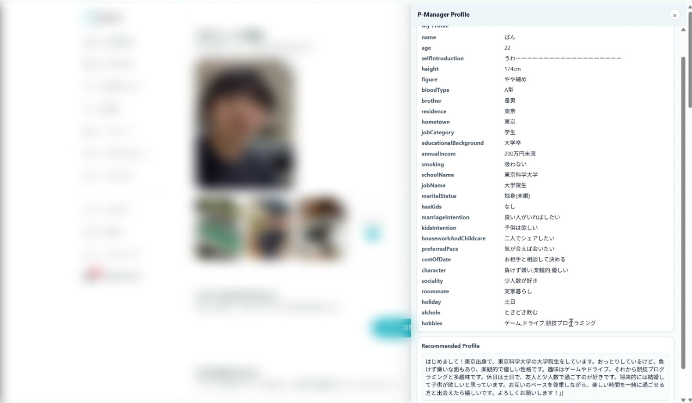
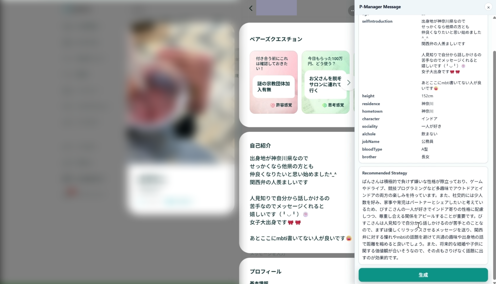
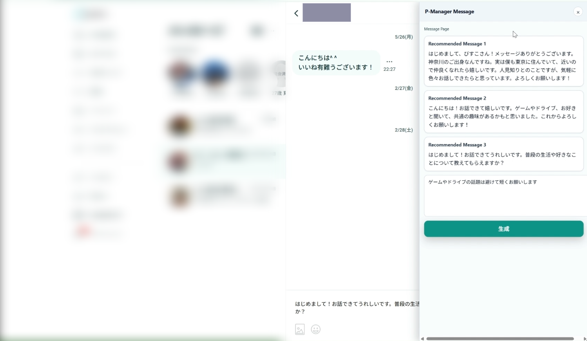
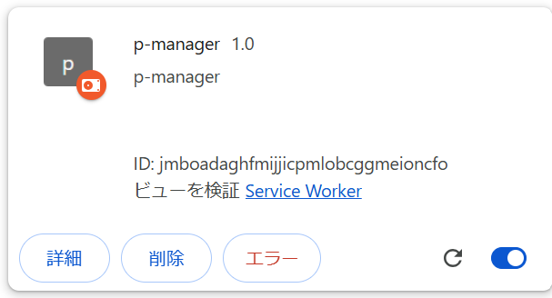

# P-Manager
## 機能
自己紹介文を自動で作成してくれます


相手のプロフィールから戦略を立てます


過去のチャットから次のメッセージを提案してくれます



## 使用方法 Windows
### Chrome拡張機能
1. PManagerパッケージを`C:\Users\name\AppData\Local`に展開してください
2. Chromeを起動し`chrome://extensions`を開いてください
3. 「パッケージ化されていない拡張機能を読み込む」をクリックしてください
4. `C:\Users\name\AppData\Local\PManager\PManager`を選択してください
5. 拡張機能のIDをコピーしておいてください。例 `jmboadaghfmijjicpmlobcggmeioncfo`


### native-hostの設定
1. `C:\Users\name\AppData\Local\PManager\PManager`の`p_manager_host_chrome.json`を開きましょう
2. こうなっているはずです
```json
{
  "name": "p_manager_host_chrome",
  "description": "p-manager-host",
  "path": "C:\\Users\\user_name\\AppData\\Local\\PManager\\PManager\\bin\\native-host.exe",
  "type": "stdio",
  "allowed_origins":["chrome-extension://id/"]
}
```
3. 開いたjsonファイルの`"path"`の`user_name`をあなたのユーザ名に変更してください
4. 開いたjsonファイルの`"allowed_origins"`の`id`を先ほどコピーした拡張機能のIDに書き換えてください
5. こんな感じです
```json
{
  "name": "p_manager_host_chrome",
  "description": "p-manager-host",
  "path": "C:\\Users\\hases\\AppData\\Local\\PManager\\PManager\\bin\\native-host.exe",
  "type": "stdio",
  "allowed_origins":["chrome-extension://jmboadaghfmijjicpmlobcggmeioncfo/"]
}
```
6. Windows PowerShellを開いて以下を実行してください
```
powershell -ExecutionPolicy Bypass -File $env:LOCALAPPDATA\PManager\PManager\register-nativehost.ps1`
```

### ChatGPT APIキーの取得
ChatGPTのAPIキーがないと自動生成はできません
1. `https://platform.openai.com/api-keys`でapiキーを作成
2. `C:\\Users\\user_name\\AppData\\Local\\PManager\\PManager`にある、`GPT_API_KEY.txt`にapiキーをそのままペーストしてください

## 利用規約について
https://pairs.lv/static/termsofservice

当社の本サービスの保守や改良などの必要が生じた場合には、当社は利用者が当社の管理するサーバーに保存しているデータを、本サービスの保守や改良などに必要な範囲で複製等することができるものとします。
...

当社は、投稿コンテンツの利用を、利用者自身を除く、他の利用者その他の第三者に許諾するものではなく、利用者は他の利用者の投稿コンテンツの権利を侵害する行為を行ってはならないものとします。また、**利用者は投稿コンテンツをクロール等で自動的に収集、解析する行為も行ってはならないものとします。**


このツールは投稿コンテンツを完全に自動的に収集、解析しているわけではありません。このツールは投稿コンテンツを明示的な操作（生成ボタンのクリック）でのみ解析しています。これは一般ユーザーが画面のスクリーンショットを取ったり、テキストをコピー＆ペーストすることとなんら変わりないと主張します。